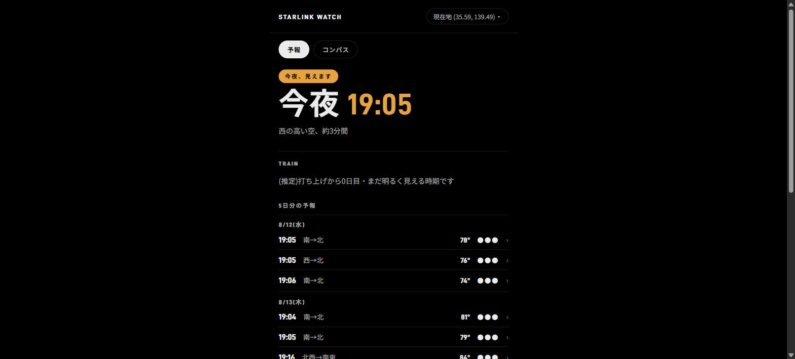
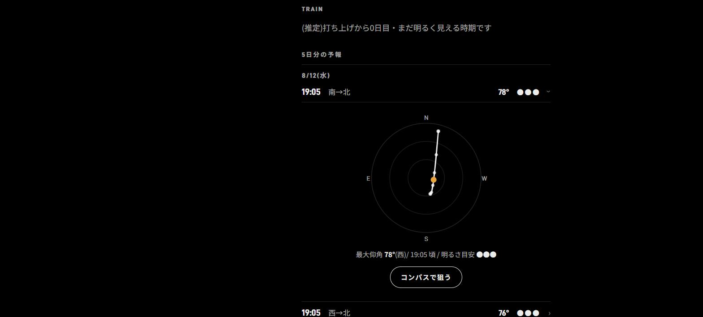
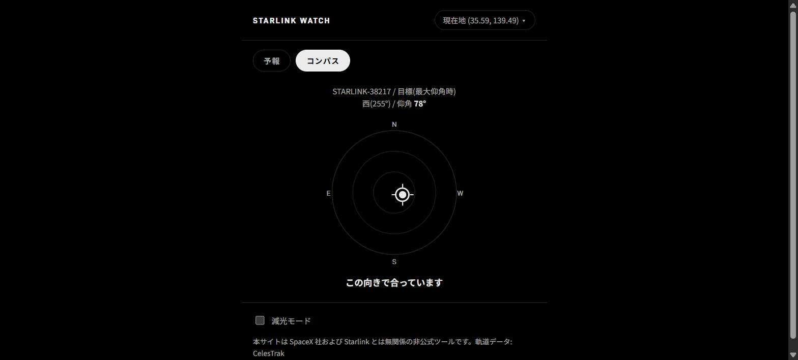

<div align="center">

# 🛰️ Starlink Watch

### ✨ 今夜、外に出れば見えるのか? に即答するアプリ ✨

*Will you see a Starlink train tonight? Ask, and know in seconds.*

[](https://starlink-watcher.vercel.app)
[](https://vitejs.dev/)
[](https://www.typescriptlang.org/)
[](#)

**🌐 [starlink-watcher.vercel.app](https://starlink-watcher.vercel.app) 🌐**

</div>

<br>

<div align="center">
<table>
<tr>
<td align="center" width="33%">
<br>
<sub>🌃 5日分の可視パス予報</sub>
</td>
<td align="center" width="33%">
<br>
<sub>🎯 方位図(スカイチャート)</sub>
</td>
<td align="center" width="33%">
<br>
<sub>🧭 コンパス連動の狙い画面</sub>
</td>
</tr>
</table>
</div>

<br>

<div align="center">

### 🌐 Language / 言語 / 语言 / Langue / Idioma / Язык / اللغة

**[🇯🇵 日本語](#lang-ja) · [🇺🇸 English](#lang-en) · [🇨🇳 中文](#lang-zh) · [🇫🇷 Français](#lang-fr) · [🇪🇸 Español](#lang-es) · [🇷🇺 Русский](#lang-ru) · [🇸🇦 العربية](#lang-ar)**

*下の見出しをクリックすると各言語のセクションへジャンプします / Click a heading below to jump to that language's section*

</div>

<br>

---

## <a id="lang-ja"></a>🇯🇵 日本語

<details open>
<summary><b>クリックで開閉 / Click to expand</b></summary>
<br>

### 🌌 概要

**Starlink Watch** は、「今夜、外に出れば Starlink 衛星が見えるのか?」に即答してくれる Web アプリです。観測地点を設定するだけで、5日分の可視パス予報・方位図・打ち上げ直後の「トレイン」検出まで、ブラウザだけで完結します。サーバーは存在しません。軌道計算はすべてあなたの端末の中で行われます。🛰️

### ✨ 主な機能

- 📍 **観測地点の設定** — 現在地ボタン・地名検索・緯度経度の手入力に対応、`localStorage` に保存されるので次回訪問時もそのまま
- 🌃 **5日分の可視パス予報** — 日時・方角・最大仰角・明るさの目安(3段階)を一覧表示
- 🎯 **方位図(方位チャート)** — 気になるパスをタップすると、極座標のスカイチャートで「どこを見ればいいか」が一目でわかる
- 🧭 **iPhoneコンパス連動** — スマホの方位センサーと連動し、実際に空へかざして衛星を狙える専用画面(レティクル=目標、丸=端末の向き)
- 🚀 **打ち上げ直後トレインの検出** — TLEデータから低軌道の「トレイン」編隊を自動検出し、優先的に表示(まだ明るく見える貴重な時期をお知らせ)
- 🌓 **減光モード** — 夜間の暗い場所でも目に優しい表示に切り替え可能
- 🔄 **毎日自動更新** — GitHub Actions が日次で軌道データを取得し、Vercel が自動デプロイ

### 📱 使い方

1. アプリを開く(下記の公開URL、またはローカルで起動)
2. ヘッダーの「現在地を使う」を押すか、地名・緯度経度で観測地点を設定する
3. 「今夜、見えます」のような判定と、5日分の予報リストが表示される
4. 気になるパスの行をタップすると、方位図が展開する
5. 「コンパスで狙う」を押すと、スマホの方位センサーと連動した専用画面が開く(iOSでは初回にセンサーへのアクセス許可が必要)
6. 暗い場所では「減光モード」をオンにすると画面が眩しくない

> 🔭 肉眼で見つけやすいのは、運用軌道(高度約550km)の衛星よりも、**打ち上げ直後数日〜数週間の「トレイン」** です。TRAINバンドが出ているときはチャンスです!

### 🛠️ 技術スタック

| 分野 | 使用技術 |
|---|---|
| ビルド | [Vite](https://vitejs.dev/) + [TypeScript](https://www.typescriptlang.org/) |
| UI | フレームワークなし(vanilla DOM) |
| 軌道計算 | [satellite.js](https://github.com/shashwatak/satellite-js)(SGP4伝播) |
| 太陽位置 | [suncalc](https://github.com/mourner/suncalc) |
| テスト | [Vitest](https://vitest.dev/) |
| ホスティング | [Vercel](https://vercel.com/)(GitHub連携で自動デプロイ) |
| 自動更新 | GitHub Actions(日次cron) |

### 💻 ローカル開発

```bash
git clone https://github.com/valisolaris/starlink-watcher.git
cd starlink-watcher
npm install

npm run dev             # 開発サーバー起動 (http://localhost:5173)
npm run test             # テスト実行 (Vitest)
npm run build             # 型チェック + 本番ビルド
npm run build:snapshot    # CelesTrakから軌道データスナップショットを生成
```

### 🏗️ アーキテクチャ

完全静的サイトです。SGP4による軌道伝播はすべてブラウザ内(`satellite.js`)で計算され、バックエンドサーバーは存在しません。

軌道データは GitHub Actions が日次で [CelesTrak](https://celestrak.org/) から取得し、軽量なスナップショット(`public/data/gp-snapshot.json.gz`)としてリポジトリへ自動コミットします。クライアントはこのスナップショットを優先的に読み込み、データが古い(24時間超)場合のみ CelesTrak へ直接アクセスします。Vercel が Git 連携で自動デプロイを行います。

### 📄 ライセンス・免責事項

- フォント: **D-DIN** / **D-DIN Bold** — © Datto Inc., [SIL Open Font License 1.1](https://scripts.sil.org/OFL) のもとで使用
- 軌道データ: [CelesTrak](https://celestrak.org/)

> 本サイトは SpaceX 社および Starlink とは無関係の非公式ツールです。

</details>

---

## <a id="lang-en"></a>🇺🇸 English

<details>
<summary><b>Click to expand</b></summary>
<br>

### 🌌 Overview

**Starlink Watch** is a web app that gives you an instant answer to "If I step outside tonight, will I see a Starlink satellite?" Just set your observation site and everything happens right in your browser: a 5-day visible-pass forecast, sky charts, and detection of freshly launched "trains." There is no server. All orbital calculations run entirely on your own device. 🛰️

### ✨ Key Features

- 📍 **Observation site setup** — Use the current-location button, search by place name, or enter latitude and longitude by hand; your site is saved to `localStorage` so it's still there on your next visit
- 🌃 **5-day visible-pass forecast** — A list view showing date and time, direction, maximum elevation, and a three-level brightness estimate
- 🎯 **Sky chart (azimuth chart)** — Tap a pass that catches your eye and a polar sky chart shows you at a glance exactly where to look
- 🧭 **iPhone compass integration** — A dedicated screen that links to your phone's orientation sensor so you can hold it up to the sky and aim at the satellite (reticle = target, circle = device heading)
- 🚀 **Post-launch train detection** — Automatically detects low-orbit "train" formations from TLE data and prioritizes them in the display (so you don't miss the precious window while they're still bright)
- 🌓 **Dim mode** — Switch to an eye-friendly display for dark locations at night
- 🔄 **Daily automatic updates** — GitHub Actions fetches orbital data daily and Vercel deploys automatically

### 📱 How to Use

1. Open the app (at the public URL below, or run it locally)
2. Press "Use current location" in the header, or set your observation site by place name or latitude/longitude
3. A verdict such as "Visible tonight" appears along with the 5-day forecast list
4. Tap the row of a pass you're interested in and the sky chart expands
5. Press "Aim with compass" to open a dedicated screen linked to your phone's orientation sensor (on iOS, sensor access permission is required the first time)
6. In dark locations, turn on "Dim mode" so the screen isn't dazzling

> 🔭 The easiest satellites to spot with the naked eye aren't the ones in the operational orbit (about 550 km altitude) — they're the **"trains" in the days to weeks right after launch**. When a TRAIN band is showing, it's your chance!

### 🛠️ Tech Stack

| Area | Technology |
|---|---|
| Build | [Vite](https://vitejs.dev/) + [TypeScript](https://www.typescriptlang.org/) |
| UI | No framework (vanilla DOM) |
| Orbital calculation | [satellite.js](https://github.com/shashwatak/satellite-js) (SGP4 propagation) |
| Sun position | [suncalc](https://github.com/mourner/suncalc) |
| Testing | [Vitest](https://vitest.dev/) |
| Hosting | [Vercel](https://vercel.com/) (automatic deploys via GitHub integration) |
| Auto-updates | GitHub Actions (daily cron) |

### 💻 Local Development

```bash
git clone https://github.com/valisolaris/starlink-watcher.git
cd starlink-watcher
npm install

npm run dev             # Start the dev server (http://localhost:5173)
npm run test             # Run the tests (Vitest)
npm run build             # Type check + production build
npm run build:snapshot    # Generate an orbital data snapshot from CelesTrak
```

### 🏗️ Architecture

This is a fully static site. All SGP4 orbital propagation is calculated inside the browser (`satellite.js`), and there is no backend server.

GitHub Actions fetches orbital data daily from [CelesTrak](https://celestrak.org/) and automatically commits it to the repository as a lightweight snapshot (`public/data/gp-snapshot.json.gz`). The client loads this snapshot first and only accesses CelesTrak directly when the data is stale (more than 24 hours old). Vercel handles automatic deployment through its Git integration.

### 📄 License and Disclaimer

- Fonts: **D-DIN** / **D-DIN Bold** — © Datto Inc., used under the [SIL Open Font License 1.1](https://scripts.sil.org/OFL)
- Orbital data: [CelesTrak](https://celestrak.org/)

> This site is an unofficial tool with no affiliation to SpaceX or Starlink.

</details>

---

## <a id="lang-zh"></a>🇨🇳 中文

<details>
<summary><b>点击展开</b></summary>
<br>

### 🌌 概述

**Starlink Watch** 是一款能立即回答「今晚出门能看到 Starlink 卫星吗?」的 Web 应用。只需设置观测地点,5 天的可见过境预报、方位图、以及刚发射不久的「星链列车」检测,全部都能在浏览器中完成。没有服务器,所有轨道计算都在你的设备内进行。🛰️

### ✨ 主要功能

- 📍 **观测地点设置** — 支持定位按钮、地名搜索、手动输入经纬度,并保存到 `localStorage`,下次访问时自动沿用
- 🌃 **5 天可见过境预报** — 以列表展示日期时间、方向、最大仰角和亮度参考(3 个等级)
- 🎯 **方位图(方位图表)** — 点击感兴趣的过境,即可通过极坐标星空图一眼看出「该往哪里看」
- 🧭 **iPhone 罗盘联动** — 与手机的方位传感器联动,可实际举起手机对准天空捕捉卫星的专用界面(准星=目标,圆点=设备朝向)
- 🚀 **发射后星链列车检测** — 从 TLE 数据中自动检测低轨道的「列车」编队并优先显示(提示你仍然明亮可见的宝贵时期)
- 🌓 **暗光模式** — 可切换为在夜间黑暗环境下也不刺眼的显示方式
- 🔄 **每日自动更新** — GitHub Actions 每日获取轨道数据,Vercel 自动部署

### 📱 使用方法

1. 打开应用(下方的公开 URL,或在本地启动)
2. 点击页首的「使用当前位置」,或通过地名、经纬度设置观测地点
3. 界面会显示类似「今晚可见」的判断结果,以及 5 天的预报列表
4. 点击感兴趣的过境行,即可展开方位图
5. 点击「用罗盘对准」,会打开与手机方位传感器联动的专用界面(iOS 首次使用需要授予传感器访问权限)
6. 在黑暗的地方开启「暗光模式」,屏幕就不会刺眼

> 🔭 用肉眼更容易找到的,不是运行轨道(高度约 550km)上的卫星,而是**发射后数天至数周的「星链列车」**。当 TRAIN 标识出现时就是好机会!

### 🛠️ 技术栈

| 领域 | 使用技术 |
|---|---|
| 构建 | [Vite](https://vitejs.dev/) + [TypeScript](https://www.typescriptlang.org/) |
| UI | 无框架(vanilla DOM) |
| 轨道计算 | [satellite.js](https://github.com/shashwatak/satellite-js)(SGP4 传播) |
| 太阳位置 | [suncalc](https://github.com/mourner/suncalc) |
| 测试 | [Vitest](https://vitest.dev/) |
| 托管 | [Vercel](https://vercel.com/)(通过 GitHub 集成自动部署) |
| 自动更新 | GitHub Actions(每日 cron) |

### 💻 本地开发

```bash
git clone https://github.com/valisolaris/starlink-watcher.git
cd starlink-watcher
npm install

npm run dev             # 启动开发服务器 (http://localhost:5173)
npm run test             # 运行测试 (Vitest)
npm run build             # 类型检查 + 生产构建
npm run build:snapshot    # 从 CelesTrak 生成轨道数据快照
```

### 🏗️ 架构

这是一个完全静态的站点。基于 SGP4 的轨道传播全部在浏览器内(`satellite.js`)计算,不存在后端服务器。

轨道数据由 GitHub Actions 每日从 [CelesTrak](https://celestrak.org/) 获取,并作为轻量快照(`public/data/gp-snapshot.json.gz`)自动提交到仓库。客户端优先加载该快照,仅在数据过旧(超过 24 小时)时才直接访问 CelesTrak。Vercel 通过 Git 集成进行自动部署。

### 📄 许可与免责声明

- 字体: **D-DIN** / **D-DIN Bold** — © Datto Inc.,依据 [SIL Open Font License 1.1](https://scripts.sil.org/OFL) 使用
- 轨道数据: [CelesTrak](https://celestrak.org/)

> 本站点是与 SpaceX 公司及 Starlink 无关的非官方工具。

</details>

---

## <a id="lang-fr"></a>🇫🇷 Français

<details>
<summary><b>Cliquez pour développer</b></summary>
<br>

### 🌌 Aperçu

**Starlink Watch** est une application web qui répond instantanément à la question : « Est-ce que je verrai des satellites Starlink si je sors ce soir ? » Il suffit de définir un lieu d'observation pour obtenir, entièrement dans le navigateur, les prévisions de passages visibles sur 5 jours, la carte du ciel et la détection des « trains » juste après un lancement. Il n'y a aucun serveur : tous les calculs orbitaux sont effectués sur votre appareil. 🛰️

### ✨ Fonctionnalités principales

- 📍 **Définition du lieu d'observation** — bouton de position actuelle, recherche par nom de lieu ou saisie manuelle des coordonnées ; le lieu est enregistré dans le `localStorage` et conservé lors de votre prochaine visite
- 🌃 **Prévisions de passages visibles sur 5 jours** — liste indiquant la date et l'heure, la direction, l'élévation maximale et une estimation de la luminosité (3 niveaux)
- 🎯 **Carte du ciel (graphique azimutal)** — touchez un passage qui vous intéresse et une carte du ciel en coordonnées polaires vous montre d'un coup d'œil où regarder
- 🧭 **Synchronisation avec la boussole de l'iPhone** — un écran dédié qui se synchronise avec le capteur d'orientation du smartphone pour viser le satellite en pointant réellement l'appareil vers le ciel (le réticule indique la cible, le cercle l'orientation de l'appareil)
- 🚀 **Détection des trains juste après un lancement** — les formations en « train » sur orbite basse sont détectées automatiquement à partir des données TLE et affichées en priorité (vous êtes averti pendant la précieuse période où elles sont encore bien visibles)
- 🌓 **Mode sombre atténué** — bascule vers un affichage reposant pour les yeux, même dans l'obscurité nocturne
- 🔄 **Mise à jour automatique quotidienne** — GitHub Actions récupère chaque jour les données orbitales et Vercel déploie automatiquement

### 📱 Utilisation

1. Ouvrez l'application (via l'URL publique ci-dessous, ou en local)
2. Appuyez sur « Utiliser ma position » dans l'en-tête, ou définissez le lieu d'observation par nom ou par coordonnées
3. Un verdict du type « Visible ce soir » s'affiche, accompagné de la liste des prévisions sur 5 jours
4. Touchez la ligne d'un passage qui vous intéresse pour déployer la carte du ciel
5. Appuyez sur « Viser à la boussole » pour ouvrir l'écran dédié synchronisé avec le capteur d'orientation du smartphone (sur iOS, une autorisation d'accès au capteur est demandée la première fois)
6. Dans l'obscurité, activez le « mode sombre atténué » pour que l'écran n'éblouisse pas

> 🔭 À l'œil nu, les plus faciles à repérer ne sont pas les satellites sur leur orbite opérationnelle (environ 550 km d'altitude), mais les **« trains » des quelques jours à quelques semaines suivant un lancement**. Quand le bandeau TRAIN est affiché, c'est le moment idéal !

### 🛠️ Stack technique

| Domaine | Technologies utilisées |
|---|---|
| Build | [Vite](https://vitejs.dev/) + [TypeScript](https://www.typescriptlang.org/) |
| UI | aucun framework (vanilla DOM) |
| Calcul orbital | [satellite.js](https://github.com/shashwatak/satellite-js) (propagation SGP4) |
| Position du Soleil | [suncalc](https://github.com/mourner/suncalc) |
| Tests | [Vitest](https://vitest.dev/) |
| Hébergement | [Vercel](https://vercel.com/) (déploiement automatique via l'intégration GitHub) |
| Mise à jour automatique | GitHub Actions (cron quotidien) |

### 💻 Développement local

```bash
git clone https://github.com/valisolaris/starlink-watcher.git
cd starlink-watcher
npm install

npm run dev             # Démarrage du serveur de développement (http://localhost:5173)
npm run test             # Exécution des tests (Vitest)
npm run build             # Vérification des types + build de production
npm run build:snapshot    # Génération d'un instantané des données orbitales depuis CelesTrak
```

### 🏗️ Architecture

Il s'agit d'un site entièrement statique. La propagation orbitale SGP4 est intégralement calculée dans le navigateur (`satellite.js`) et il n'existe aucun serveur backend.

Les données orbitales sont récupérées chaque jour depuis [CelesTrak](https://celestrak.org/) par GitHub Actions, puis validées automatiquement dans le dépôt sous la forme d'un instantané léger (`public/data/gp-snapshot.json.gz`). Le client charge cet instantané en priorité et n'accède directement à CelesTrak que lorsque les données sont périmées (plus de 24 heures). Vercel se charge du déploiement automatique via l'intégration Git.

### 📄 Licence et avertissement

- Polices : **D-DIN** / **D-DIN Bold** — © Datto Inc., utilisées sous [SIL Open Font License 1.1](https://scripts.sil.org/OFL)
- Données orbitales : [CelesTrak](https://celestrak.org/)

> Ce site est un outil non officiel, sans aucun lien avec SpaceX ni avec Starlink.

</details>

---

## <a id="lang-es"></a>🇪🇸 Español

<details>
<summary><b>Haz clic para expandir</b></summary>
<br>

### 🌌 Descripción general

**Starlink Watch** es una aplicación web que responde al instante a la pregunta «¿Podré ver satélites Starlink si salgo esta noche?». Basta con configurar el punto de observación para obtener, sin salir del navegador, la previsión de pases visibles de 5 días, el gráfico de orientación e incluso la detección de los «trenes» recién lanzados. No hay servidor: todos los cálculos orbitales se realizan dentro de tu propio dispositivo. 🛰️

### ✨ Funciones principales

- 📍 **Configuración del punto de observación** — botón de ubicación actual, búsqueda por nombre de lugar e introducción manual de latitud y longitud; se guarda en `localStorage`, así que se mantiene en tu próxima visita
- 🌃 **Previsión de pases visibles a 5 días** — lista con fecha y hora, dirección, elevación máxima y una estimación del brillo (3 niveles)
- 🎯 **Gráfico de orientación (carta del cielo)** — al tocar el pase que te interese, una carta del cielo en coordenadas polares te muestra de un vistazo hacia dónde mirar
- 🧭 **Integración con la brújula del iPhone** — pantalla dedicada que se sincroniza con el sensor de orientación del móvil para apuntar al satélite levantando el teléfono hacia el cielo (retícula = objetivo, círculo = orientación del dispositivo)
- 🚀 **Detección de trenes recién lanzados** — detecta automáticamente las formaciones «tren» de órbita baja a partir de los datos TLE y las muestra de forma prioritaria (te avisa de ese valioso periodo en que todavía se ven brillantes)
- 🌓 **Modo atenuado** — permite cambiar a una presentación más suave para la vista incluso de noche en lugares oscuros
- 🔄 **Actualización diaria automática** — GitHub Actions descarga los datos orbitales a diario y Vercel despliega automáticamente

### 📱 Cómo se usa

1. Abre la aplicación (en la URL pública indicada más abajo o ejecutándola en local)
2. Pulsa «Usar mi ubicación» en la cabecera o configura el punto de observación por nombre de lugar o por latitud y longitud
3. Aparecerá un veredicto del tipo «Esta noche se verán» junto con la lista de previsión de 5 días
4. Al tocar la fila del pase que te interese, se despliega el gráfico de orientación
5. Al pulsar «Apuntar con la brújula» se abre una pantalla dedicada sincronizada con el sensor de orientación del móvil (en iOS hay que conceder permiso de acceso al sensor la primera vez)
6. En lugares oscuros, activa el «modo atenuado» para que la pantalla no deslumbre

> 🔭 A simple vista resultan más fáciles de localizar los **«trenes» de los primeros días o semanas tras el lanzamiento** que los satélites ya en su órbita operativa (unos 550 km de altitud). ¡Cuando aparece la banda TRAIN, es tu oportunidad!

### 🛠️ Stack técnico

| Ámbito | Tecnología utilizada |
|---|---|
| Compilación | [Vite](https://vitejs.dev/) + [TypeScript](https://www.typescriptlang.org/) |
| UI | Sin framework (vanilla DOM) |
| Cálculo orbital | [satellite.js](https://github.com/shashwatak/satellite-js) (propagación SGP4) |
| Posición del Sol | [suncalc](https://github.com/mourner/suncalc) |
| Pruebas | [Vitest](https://vitest.dev/) |
| Hosting | [Vercel](https://vercel.com/) (despliegue automático con integración de GitHub) |
| Actualización automática | GitHub Actions (cron diario) |

### 💻 Desarrollo local

```bash
git clone https://github.com/valisolaris/starlink-watcher.git
cd starlink-watcher
npm install

npm run dev             # Inicia el servidor de desarrollo (http://localhost:5173)
npm run test             # Ejecuta las pruebas (Vitest)
npm run build             # Comprobación de tipos + compilación de producción
npm run build:snapshot    # Genera una instantánea de los datos orbitales desde CelesTrak
```

### 🏗️ Arquitectura

Es un sitio completamente estático. Toda la propagación orbital mediante SGP4 se calcula dentro del navegador (`satellite.js`) y no existe ningún servidor backend.

Los datos orbitales los descarga GitHub Actions a diario desde [CelesTrak](https://celestrak.org/) y los confirma automáticamente en el repositorio como una instantánea ligera (`public/data/gp-snapshot.json.gz`). El cliente carga preferentemente esa instantánea y solo accede directamente a CelesTrak cuando los datos están obsoletos (más de 24 horas). Vercel se encarga del despliegue automático mediante su integración con Git.

### 📄 Licencia y aviso legal

- Tipografías: **D-DIN** / **D-DIN Bold** — © Datto Inc., utilizadas bajo la [SIL Open Font License 1.1](https://scripts.sil.org/OFL)
- Datos orbitales: [CelesTrak](https://celestrak.org/)

> Este sitio es una herramienta no oficial y no guarda relación alguna con SpaceX ni con Starlink.

</details>

---

## <a id="lang-ru"></a>🇷🇺 Русский

<details>
<summary><b>Нажмите, чтобы раскрыть</b></summary>
<br>

### 🌌 Обзор

**Starlink Watch** — это веб-приложение, которое сразу отвечает на вопрос: «Увижу ли я спутники Starlink, если выйду на улицу сегодня вечером?». Достаточно задать точку наблюдения — и прогноз видимых пролётов на 5 дней, азимутальная карта и обнаружение «поезда» сразу после запуска работают полностью в браузере. Сервера не существует. Все орбитальные расчёты выполняются прямо на вашем устройстве. 🛰️

### ✨ Основные возможности

- 📍 **Настройка точки наблюдения** — поддерживаются кнопка определения текущего местоположения, поиск по названию места и ручной ввод широты и долготы; данные сохраняются в `localStorage`, поэтому при следующем визите всё остаётся на месте
- 🌃 **Прогноз видимых пролётов на 5 дней** — список с датой и временем, направлением, максимальной высотой над горизонтом и ориентировочной яркостью (3 градации)
- 🎯 **Азимутальная карта (диаграмма направлений)** — коснитесь интересующего пролёта, и полярная карта неба наглядно покажет, куда именно смотреть
- 🧭 **Связь с компасом iPhone** — отдельный экран, работающий с датчиком направления смартфона: наведите телефон на небо и прицельтесь в спутник (прицел — цель, кружок — направление устройства)
- 🚀 **Обнаружение «поезда» сразу после запуска** — по данным TLE автоматически определяются низкоорбитальные группы-«поезда» и выводятся в первую очередь (приложение подскажет тот ценный период, когда они ещё ярко видны)
- 🌓 **Режим затемнения** — можно переключиться на щадящее для глаз отображение в тёмном месте ночью
- 🔄 **Ежедневное автообновление** — GitHub Actions ежедневно загружает орбитальные данные, а Vercel автоматически выполняет деплой

### 📱 Как пользоваться

1. Откройте приложение (по публичному URL ниже или запустите локально)
2. Нажмите «Использовать текущее местоположение» в шапке либо задайте точку наблюдения по названию места или координатам
3. Появится вердикт вроде «Сегодня вечером видно» и список прогноза на 5 дней
4. Коснитесь строки с интересующим пролётом — развернётся азимутальная карта
5. Нажмите «Навести по компасу» — откроется отдельный экран, связанный с датчиком направления смартфона (в iOS при первом запуске нужно разрешить доступ к датчику)
6. В тёмном месте включите «Режим затемнения», и экран не будет слепить

> 🔭 Невооружённым глазом проще заметить не спутники на рабочей орбите (высота около 550 км), а **«поезда» в первые дни и недели после запуска**. Если выводится метка TRAIN — это ваш шанс!

### 🛠️ Технологический стек

| Область | Используемые технологии |
|---|---|
| Сборка | [Vite](https://vitejs.dev/) + [TypeScript](https://www.typescriptlang.org/) |
| UI | без фреймворков (vanilla DOM) |
| Орбитальные расчёты | [satellite.js](https://github.com/shashwatak/satellite-js) (распространение SGP4) |
| Положение Солнца | [suncalc](https://github.com/mourner/suncalc) |
| Тесты | [Vitest](https://vitest.dev/) |
| Хостинг | [Vercel](https://vercel.com/) (автодеплой через интеграцию с GitHub) |
| Автообновление | GitHub Actions (ежедневный cron) |

### 💻 Локальная разработка

```bash
git clone https://github.com/valisolaris/starlink-watcher.git
cd starlink-watcher
npm install

npm run dev             # запуск сервера разработки (http://localhost:5173)
npm run test             # запуск тестов (Vitest)
npm run build             # проверка типов + продакшен-сборка
npm run build:snapshot    # создание снимка орбитальных данных с CelesTrak
```

### 🏗️ Архитектура

Это полностью статический сайт. Орбитальное распространение по модели SGP4 целиком вычисляется в браузере (`satellite.js`), бэкенд-сервера не существует.

Орбитальные данные ежедневно загружает GitHub Actions с [CelesTrak](https://celestrak.org/) и автоматически коммитит в репозиторий в виде компактного снимка (`public/data/gp-snapshot.json.gz`). Клиент в первую очередь читает этот снимок и обращается напрямую к CelesTrak только тогда, когда данные устарели (более 24 часов). Автоматический деплой выполняет Vercel через интеграцию с Git.

### 📄 Лицензии и отказ от ответственности

- Шрифты: **D-DIN** / **D-DIN Bold** — © Datto Inc., используются на условиях [SIL Open Font License 1.1](https://scripts.sil.org/OFL)
- Орбитальные данные: [CelesTrak](https://celestrak.org/)

> Этот сайт — неофициальный инструмент, не связанный с компанией SpaceX и Starlink.

</details>

---

## <a id="lang-ar"></a>🇸🇦 العربية

<details>
<summary><b>انقر للتوسيع</b></summary>
<br>

<div dir="rtl">

### 🌌 نظرة عامة

**Starlink Watch** تطبيق ويب يجيب فورًا عن سؤال: «هل سأتمكّن من رؤية أقمار Starlink إذا خرجت الليلة؟». يكفي أن تضبط موقع الرصد، ليقدّم لك داخل المتصفّح وحده كل شيء: توقّعات المرور المرئي على مدى خمسة أيام، ومخطّط الاتجاهات، بل وحتى رصد «القطار» الذي يظهر بُعيد الإطلاق. لا وجود لأي خادم؛ فجميع الحسابات المدارية تجري داخل جهازك. 🛰️

### ✨ الميزات الرئيسية

- 📍 **ضبط موقع الرصد** — يدعم زرّ الموقع الحالي، والبحث باسم المكان، والإدخال اليدوي لخطّي الطول والعرض، ويُحفظ الموقع في `localStorage` فيبقى كما هو عند زيارتك التالية
- 🌃 **توقّعات المرور المرئي لخمسة أيام** — عرض قائمة بالتاريخ والوقت والاتجاه وأقصى زاوية ارتفاع ومستوى السطوع التقريبي (ثلاث درجات)
- 🎯 **مخطّط الاتجاهات (مخطّط السماء)** — بمجرّد النقر على مرور يهمّك، يتّضح لك في لمحة «إلى أين تنظر» عبر مخطّط سماء بإحداثيات قطبية
- 🧭 **التكامل مع بوصلة iPhone** — شاشة مخصّصة تتفاعل مع مستشعر الاتجاه في هاتفك، فترفعه نحو السماء وتصوّب به على القمر الصناعي (الشعيرات المتصالبة = الهدف، الدائرة = اتجاه الجهاز)
- 🚀 **رصد القطار بُعيد الإطلاق** — يكتشف تلقائيًا تشكيلة «القطار» في المدار المنخفض انطلاقًا من بيانات TLE ويعرضها بأولوية (لينبّهك إلى الفترة الثمينة التي لا تزال فيها الأقمار ساطعة)
- 🌓 **الوضع الخافت** — إمكانية التبديل إلى عرض مريح للعين حتى في الأماكن المظلمة ليلًا
- 🔄 **تحديث تلقائي يومي** — تجلب GitHub Actions البيانات المدارية يوميًا، ويتولّى Vercel النشر التلقائي

### 📱 طريقة الاستخدام

1. افتح التطبيق (عبر الرابط العام أدناه، أو بتشغيله محليًا)
2. اضغط على «استخدام الموقع الحالي» في الترويسة، أو اضبط موقع الرصد باسم المكان أو بخطّي الطول والعرض
3. سيظهر لك حكم من قبيل «يمكن رؤيتها الليلة» مع قائمة التوقّعات لخمسة أيام
4. انقر على سطر المرور الذي يهمّك، فينفتح مخطّط الاتجاهات
5. اضغط على «التصويب بالبوصلة» لتُفتح شاشة مخصّصة تتفاعل مع مستشعر الاتجاه في هاتفك (على iOS يلزم منح الإذن بالوصول إلى المستشعر في المرة الأولى)
6. في الأماكن المظلمة، فعّل «الوضع الخافت» كي لا تبهرك الشاشة

> 🔭 ما يسهل العثور عليه بالعين المجرّدة ليس أقمار المدار التشغيلي (على ارتفاع 550 كم تقريبًا)، بل **«القطار» خلال الأيام أو الأسابيع القليلة التي تلي الإطلاق**. فإذا ظهر شريط TRAIN فهذه فرصتك!

### 🛠️ التقنيات المستخدمة

| المجال | التقنية |
|---|---|
| البناء | [Vite](https://vitejs.dev/) + [TypeScript](https://www.typescriptlang.org/) |
| واجهة المستخدم | بدون إطار عمل (vanilla DOM) |
| الحسابات المدارية | [satellite.js](https://github.com/shashwatak/satellite-js) (انتشار SGP4) |
| موضع الشمس | [suncalc](https://github.com/mourner/suncalc) |
| الاختبارات | [Vitest](https://vitest.dev/) |
| الاستضافة | [Vercel](https://vercel.com/) (نشر تلقائي عبر التكامل مع GitHub) |
| التحديث التلقائي | GitHub Actions (مهمّة cron يومية) |

### 💻 التطوير المحلي

```bash
git clone https://github.com/valisolaris/starlink-watcher.git
cd starlink-watcher
npm install

npm run dev             # تشغيل خادم التطوير (http://localhost:5173)
npm run test             # تنفيذ الاختبارات (Vitest)
npm run build             # فحص الأنواع + بناء نسخة الإنتاج
npm run build:snapshot    # توليد لقطة بيانات مدارية من CelesTrak
```

### 🏗️ البنية التقنية

موقع ثابت بالكامل. تُحسب جميع عمليات الانتشار المداري بخوارزمية SGP4 داخل المتصفّح (`satellite.js`)، ولا وجود لأي خادم خلفي.

تتولّى GitHub Actions جلب البيانات المدارية يوميًا من [CelesTrak](https://celestrak.org/)، وتُودعها تلقائيًا في المستودع على هيئة لقطة خفيفة (`public/data/gp-snapshot.json.gz`). ويحمّل العميل هذه اللقطة أولًا، ولا يتّصل بـ CelesTrak مباشرةً إلا إذا كانت البيانات قديمة (أكثر من 24 ساعة). أما النشر التلقائي فيتولّاه Vercel عبر التكامل مع Git.

### 📄 الترخيص وإخلاء المسؤولية

- الخطوط: **D-DIN** / **D-DIN Bold** — © Datto Inc.، مستخدمة بموجب [SIL Open Font License 1.1](https://scripts.sil.org/OFL)
- البيانات المدارية: [CelesTrak](https://celestrak.org/)

> هذا الموقع أداة غير رسمية لا صلة لها بشركة SpaceX ولا بـ Starlink.

</div>

</details>

---

<div align="center">
<sub>🛰️ 本サイトは SpaceX 社および Starlink とは無関係の非公式ツールです。軌道データ: <a href="https://celestrak.org/">CelesTrak</a><br>
This is an unofficial, fan-made tool unaffiliated with SpaceX or Starlink. Orbital data: <a href="https://celestrak.org/">CelesTrak</a></sub>
</div>
